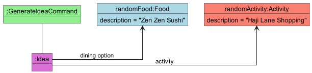
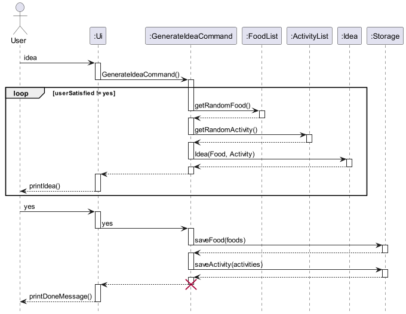
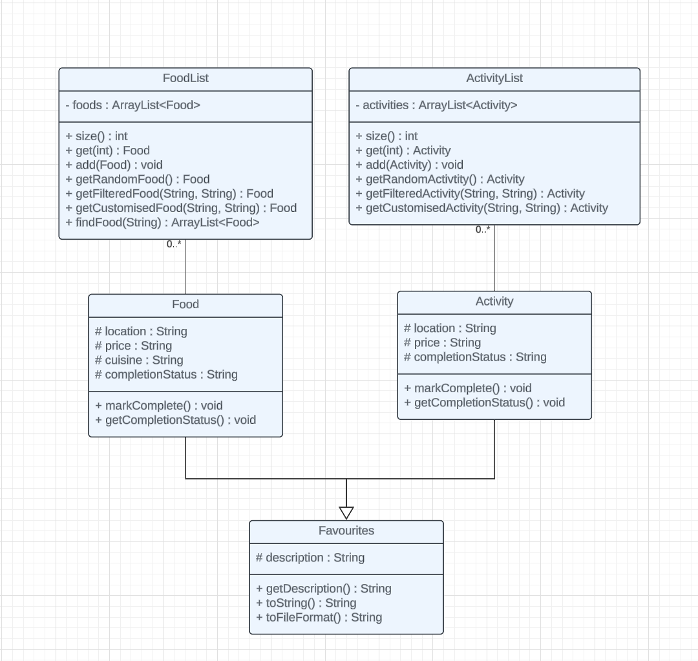
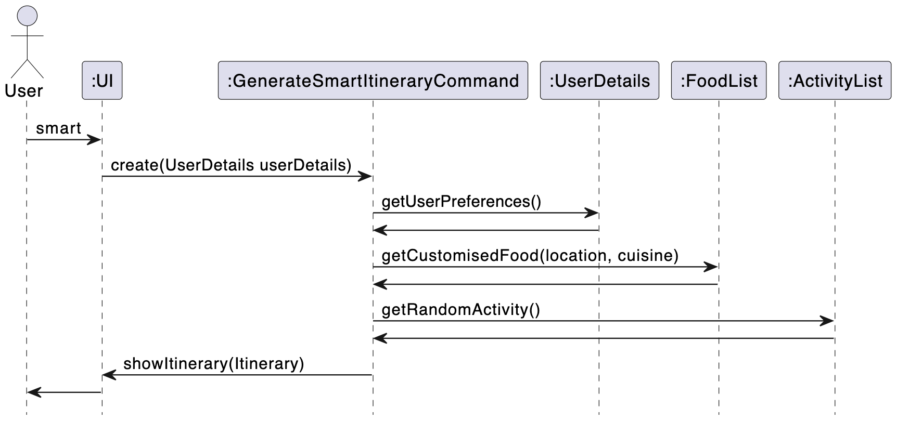
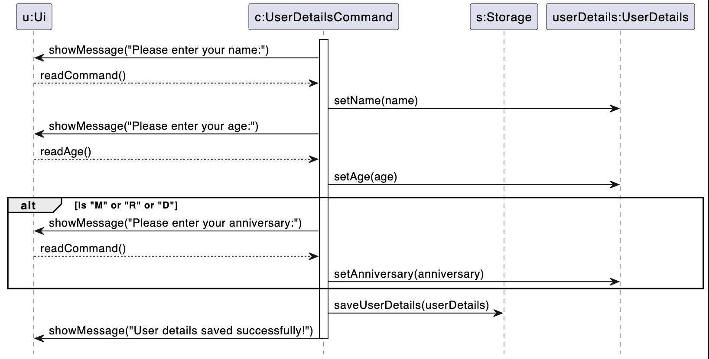
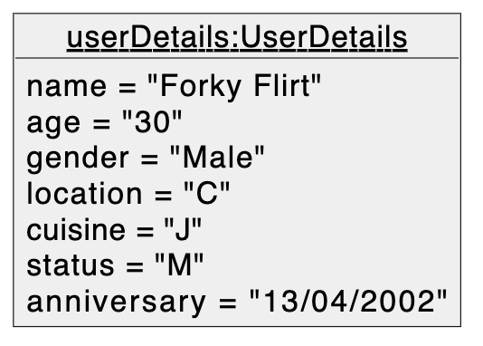
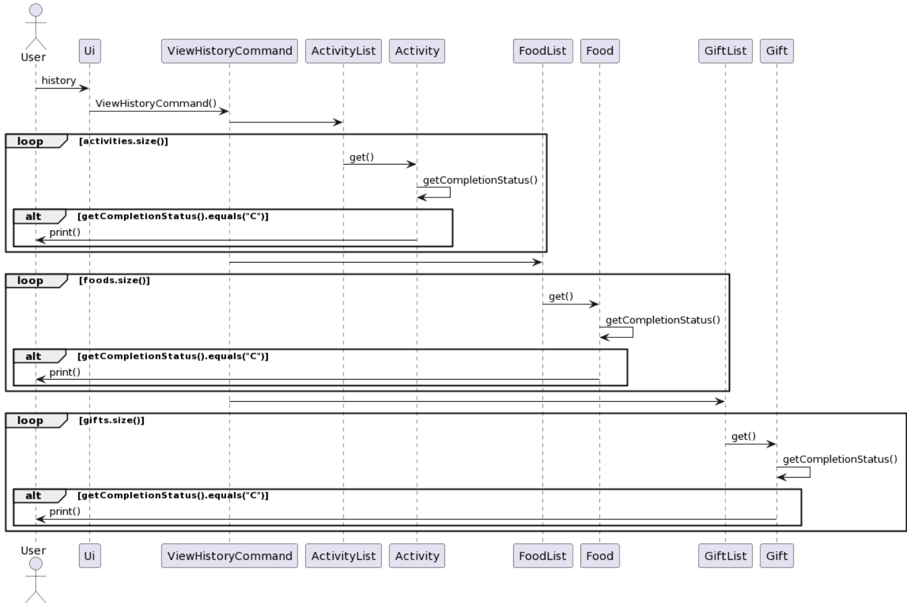
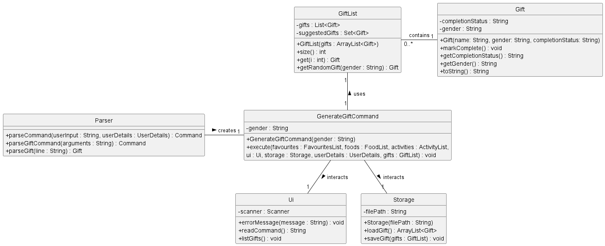
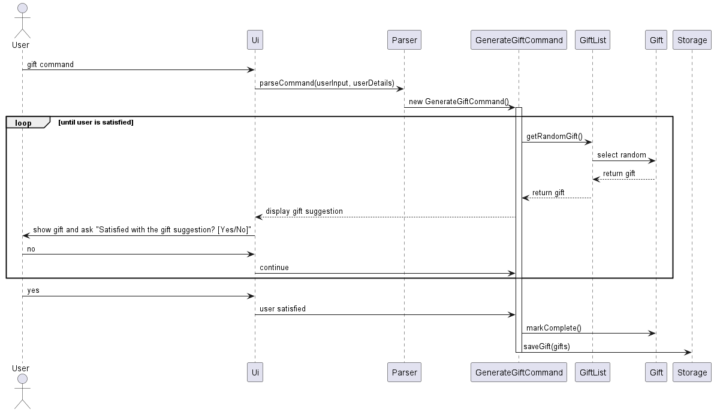

# Developer Guide

---

## Acknowledgements

We would like to acknowledge the following third-party libraries, frameworks and sources:

### Development

- **[JUnit 5](https://junit.org/junit5/)**: The java testing framework.

### Gradle

- **[Checkstyle](https://docs.gradle.org/current/userguide/checkstyle_plugin.html)**: The Gradle plugin that ensures consistent and appropriate code style.
- **[Shadow](https://github.com/johnrengelman/shadow)**: The Gradle plugin for creating fat JARs.

---

## Design & implementation

{Describe the design and implementation of the product. Use UML diagrams and short code snippets where applicable.}

### [Implemented] Generate Idea feature

#### Implementation

The existing Generate Idea feature is facilitated by `GenerateIdea` by leveraging the methods `getRandomActivity()` and `getRandomFood()` in `ActivityList` and `FoodList`. It extends `Command` and implements the following operation:

- `execute()` - Generates a randomised date idea consisting of 1 food and 1 dining option. Users can prompt to regenerate an idea until they are satisfied.

`execute()` is responsible for creating an idea object, which has takes data from a Food object and an Activity object. For example, a date idea of going to Haji Lane for shopping and habing a meal at Zen Zen Sushi is shown in the object diagram below:



Given below is an example usage scenario and how the Generate Idea mechanism behaves at each step.

Step 1. The user launches the application and executes the `idea` command. The `idea` command is parsed by the `parseCommand` method in the `Parser` class, which creates a `GenerateIdeaCommand` instance.

Step 2. The `execute` method of `GenerateIdea` is invoked. It retrieves a random activity and a random dining option from `ActivityList` and `FoodList` and presents it to the user.

Step 3. The user is not satisfied with the proposed idea and inputs the `no` command. The loop in `execute` does not meet the exit condition and thus, generates another idea using the same process as Step 2.

Step 4. The user is satisfied with the proposed idea and inputs the `yes` command. The loop in `execute` has met the exit condition and thus, the `run` method continues running allowing the user to input other commands.

The following activity diagram summarises what happens when a user inputs `idea`:


The following sequence diagram shows how `idea` the order in which methods in various classes are executed to produce a result to the user:



The following class diagrams show the `FoodList` and `ActivityList` called upon during generation of the date idea:



### [Implemented] Smart Itinerary Generation feature

#### Implementation
The Smart Itinerary Generation mechanism leverages the existing UserDetails class to retrieve user preferences and create smart itineraries. It extends the Command class with a new ```GenerateSmartItineraryCommand```. Additionally, it implements the following operations:
- ```GenerateSmartItineraryCommand(UserDetails userDetails)``` — Initializes the command with the user's stored preferences from the UserDetails object.
- ```execute(FavouritesList favourites, FoodList foods, ActivityList activities, Ui ui, Storage storage)``` — Generates a personalized itinerary by filtering food and activity options based on the user's preferences, ensures variety in the selections, and outputs the generated itinerary.

These operations are detailed in the ```Parser``` class, where the ```parseCommand(String userInput, UserDetails userDetails)``` method is updated to accept the ```UserDetails``` object and return a ```GenerateSmartItineraryCommand``` when the `"smart"` command is entered by the user.

Given below is an example usage scenario and how the Smart Itinerary Generation mechanism behaves at each step.

Step 1. The user launches the application for the first time. Their user details, including preferred location and cuisine preferences, are collected via the ```UserDetailsCommand``` and stored in a ```UserDetails``` object.

Step 2. The user enters the `"smart"` command to generate a personalized itinerary. The `"smart"` command is parsed by the ```parseCommand``` method in the ```Parser``` class, which creates a ```GenerateSmartItineraryCommand``` instance, passing the ```UserDetails``` object.

Step 3. The execute method of ```GenerateSmartItineraryCommand``` is invoked. It retrieves the user's preferred location and cuisine from the ```UserDetails``` object. The method then filters the ```FoodList``` to find food options matching the user's preferences, ensures the selected food options are distinct, and randomly selects two activities from the ```ActivityList```. The generated itinerary, consisting of the selected food and activity options, is then output to the user.



### [Implemented] User Details Collection

#### Implementation
The UserDetailsCommand is responsible for collecting personal information from the user, which includes name, age, gender, location, favorite cuisine, and relationship status. This command may also conditionally request an anniversary date based on the user's relationship status. The information is then utilized to enhance the application's service and recommendations.

This command extends the Command class and implements the following operations:

`UserDetailsCommand#execute()` — Interacts with the user via the UI to gather personal information and saves it using the `Storage` class.
Personal details such as name, age, and gender are stored in a `UserDetails` object, which is then serialized to a file by `Storage`.
These operations are exposed in the system as follows:

The `UserDetailsCommand` is instantiated and called when the user chooses to enter or update their personal details.
The execute method of this command interacts with other components like `Ui` for input/output and `Storage` for persisting user data.
Below is the sequence of actions performed by the `UserDetailsCommand` to collect user information.



Each step of the execute method interacts with the user to collect a specific piece of information. Conditional logic is applied to request the anniversary date if the relationship status warrants it. After all information is gathered, the UserDetails object's properties are set accordingly. The final step involves the Storage component saving the details, thus persisting the data for future sessions.

The above sequence diagram depicts the interaction between UserDetailsCommand, the UI, and the Storage component, which highlights the flow of data collection and storage.

#### Object Diagram
Below is an object diagram representing the state of a `UserDetails` instance after a user has entered their information.



### [Implemented] History Tracking feature

#### Implementation

The existing History Tracking feature keeps a database of previously visited restaurants, activities and gifts. It extends the Command class with a new ```ViewHistoryCommand```. Additionally, it implements the following operation:
- ```execute(FavouritesList favourites, FoodList foods, ActivityList activities, Ui ui, Storage storage, UserDetails userDetails, GiftList gifts)``` — Displays a list of all past restaurants, activities and gifts based on the user's past history.

These operations are detailed in the ```Parser``` class, where the ```parseCommand(String userInput, UserDetails userDetails)``` method is updated to return a ```ViewHistoryCommand``` when the `"history"` command is entered by the user.

Given below is an example usage scenario of how the History Tracking mechanism behaves at each step.

Step 1. The user launches the application and executes the `idea`/`itinerary`/`smart`/`gift` command. The relevant command is parsed by the `parseCommand` method in the `Parser` class, which creates a `GenerateIdeaCommand`/ `GenerateItineraryCommand`/`GenerateSmartItineraryCommand`/`GenerateGiftCommand` instance

Step 2. The `execute` method of the relevant instance is invoked. Based on the command, a random activity, dining option or gift is retrieved from `ActivityList`, `FoodList` or `GiftList` respectively, and is presented to the user

Step 3. The user is not satisfied with the proposed option and inputs the `no` command. The loop in `execute` does not meet the exit condition and thus, generates another option using the same process as Step 2.

Step 4. The user is satisfied with the proposed option and inputs the `yes` command. The loop in `execute` has met the exit condition and thus, the `run` method continues running allowing the user to input other commands.

Step 5. Upon inputting the `yes` command, the system assumes that the user has decided to take up the proposed suggestion. The `markComplete` method of the relevant Food/Activity/Gift instance is invoked, updating the completion status of the instance from 'U'(Uncompleted) to 'C'(Completed). The `saveFood`/`saveActivity`/`saveGift` method of the `Storage` class is then invoked, which rewrites the relevant data stored in `FoodList.txt`/`ActivityList.txt`/`GiftList.txt`.

Step 6. The user decides to look at past dates, and inputs the command `history`. This command is parsed by the `parseCommand` method in the `Parser` class, which creates a `ViewHistoryCommand` instance.

Step 7. The `execute` method of the instance is invoked. The system iterates through each Activity instance in `ActivityList`, each Food instance in `FoodList`, and each Gift instance in `GiftList`, invoking the method `getCompletionStatus` each time. If the `getCompletionStatus` method returns the string `C`, the system registers the specific instance as having been completed and thus prints it out

The following activity diagram summarises how the history database is displayed when a user inputs the command `history`:


### [Implemented] Generate Random Gift Suggestion

This feature enhances the user experience by offering access to a curated list of gift ideas and enabling the generation of random gift suggestions. 

#### Feature Components and Interaction

The feature comprise several key components.

**`Gift` Class:**
- Inherits from the `Favourites` class.
- Adds specific attributes like `gender` and `completionStatus` to manage gift properties effectively.
- Methods such as `markComplete()` to change the status once a gift is accepted by the user.

**`GiftList` Class:**
- Manages a collection (`ArrayList<Gift>`) of gifts and keeps track of which gifts have been suggested (`HashSet<Gift>`).
- Includes functionality to retrieve a random gift that hasn't been suggested or marked as complete, enhancing the user experience by providing fresh suggestions.

**`GenerateGiftCommand` Class:**
- Executes the process of fetching and suggesting a gift from the `GiftList`.
- Handles user interactions during the suggestion process, processing responses to either continue suggesting, accept the gift, or exit the suggestion loop.

**`Ui` Class:**
- Facilitates user interaction by displaying messages and capturing user input, which guides the flow of the gift suggestion process.

**`Storage` Class:**
- Responsible for loading and saving gift data to ensure that the `GiftList` is persistent across sessions, maintaining the state of which gifts have been suggested or accepted.

**`Parser` Class:**
- Interprets user commands and directs the application to execute specific actions based on the user input, such as initiating the gift suggestion process.



**Component Interaction Flow**

**1. Initialisation**
- The `Storage` class loads existing gift data from the `GiftList.txt` file into a `GiftList` object at application startup. 
- This ensures that the application remembers which gifts have been previously suggested or marked as complete.
   
**2. Command Parsing**
- The `Parser` class determines when the `GenerateGiftCommand` should be activated based on user input (e.g., `gift`, `gift male`, `gift female`, or `gift unisex`). 
- It creates an instance of this command with the specified gender parameter.
   
**3. Generating Gift Suggestions**
- The `GenerateGiftCommand` interacts with the `GiftList` to fetch a random gift that matches the specified gender and hasn’t been completed or previously suggested.
- If a gift is available, it is presented to the user through the `Ui` class, which asks whether the user is satisfied with the suggestion.

**4. User Interaction Loop**
- The user's response is handled in a loop:
  - Accept (yes): The gift’s `markComplete()` method is called, and the gift is marked as completed.
  - Reject (no): Another gift suggestion is fetched from the `GiftList`, and the process repeats.
  - Exit (cancel): Exits the gift suggestion loop and ends the command execution.

**5. Data Saving**
- After exiting the loop (either through acceptance of a gift or cancellation), the `Storage` class updates the gift data file to reflect any changes (e.g., marking a gift as complete).



#### Design Considerations

- Using a class hierarchy where `Gift` extends `Favourites` allows for easy addition of new types of favourites in the future.
- Segregating functionalities into distinct classes (`Gift`, `GiftList`, `GenerateGiftCommand`, etc.) enhances modularity, making the codebase more maintainable and scalable.
- Random selection from the `GiftList` ensures a diverse range of suggestions, enhancing user experience by preventing repetitive recommendations.
- Utilising a text file for storing gift data ensures simplicity and reliability, avoiding over-complication with external databases or dependencies.
- By enabling gender-specific gift suggestions, the application can provide more targeted and relevant options.
- At the same time, it also retains flexibility by allowing users to opt for non-gendered suggestions when preferences are not specified.

## Product scope
### Target user profile

Couples in Singapore

### Value proposition

In today's fast-paced world, maintaining a healthy and exciting relationship can often be challenging for couples. Balancing work, personal responsibilities, and quality time with a partner requires effort and planning. Many couples struggle to come up with new and interesting date ideas that cater to both partners' preferences, leading to a routine that can become stale and uninspiring. This is where Flirt and Fork steps in to rejuvenate the love life of couples by offering a seamless, engaging, and personalised date planning experience.

## User Stories

|Version| As a ... | I want to ... | So that I can ...|
|--------|----------|---------------|------------------|
|v1.0|first-time user|see a help message|know how to use the features within the app & its parameters|
|v1.0|busy user|effortlessly generate date ideas|not waste time endlessly searching for ideas|
|v1.0|budget conscious user|generate a date itinerary based on price|choose when to splurge and when to save|
|v1.0|user looking for variety|view a variety of date activities|enjoy diverse date experiences|
|v1.0|experienced user of the platform|save some of my preferred activities|reference back to them in future|

## Non-Functional Requirements

1. **Performance Requirements**: The application should have a rapid response time, aiming to generate personalized date ideas within a few seconds after the user inputs their preferences.

2. **Usability Requirements**: Despite being a command-line interface, the app should offer a user-friendly experience. Instructions should be clear and input errors should be handled gracefully, offering suggestions for correction. 

3. **Security Requirements**: User data, including their preferences, location, and budget, should be securely handled. 

## Glossary


Generate Idea Feature: A feature within the application that generates random date ideas consisting of food and activity suggestions.

Smart Itinerary Generation Feature: A proposed feature that creates personalized itineraries based on user preferences, ensuring variety and suitability.

History Tracking Feature: A proposed feature that keeps a record of past date activities, allowing users to track their date history and preferences.

Gift-related Features: Features related to suggesting and managing gift ideas for special occasions or romantic gestures.

Gift Class: A class representing a gift item, including its description and completion status.

GiftList Class: A class managing a collection of gift items and providing methods to access and manipulate the list.

GenerateGiftCommand Class: A command class responsible for generating random gift suggestions and handling user feedback.

ListOptionsCommands Class: A command class that provides functionality to list different types of options, including gifts, food, and activities.

ViewHistoryCommand Class: A command class that displays a history of saved gift ideas or past date activities.

Storage Class: A class responsible for managing data persistence for gift items and other application data.


## Instructions for manual testing

{Give instructions on how to do a manual product testing e.g., how to load sample data to be used for testing}


**Generate Idea Feature:**

Launch the application.

Execute the "idea" command.

Verify that the application generates random date ideas consisting of food and activity suggestions.
Test the regeneration option to ensure that users can request new ideas until satisfied.

**Smart Itinerary Generation Feature (Proposed):**

Launch the application.

Ensure that user preferences are stored in the UserDetails object.

Execute the "smart" command.

Verify that the application generates a personalized itinerary based on user preferences, including food and activity options.

**History Tracking Feature (Proposed):**

Launch the application.

Verify that past date activities and gift ideas are stored and accessible.

Execute the "history" command.

Verify that the application displays a list of past date activities or gift ideas.

**Gift-related Features:**

Ensure that the application allows users to view a curated list of gift ideas.

Execute the "gift" command.

Verify that the application generates random gift suggestions.

Test the option to mark selected gifts as complete and view past gift ideas.
Ensure that changes to gift selections are persisted across sessions.

**Non-Functional Requirements:**

Test application performance under various loads to ensure responsiveness.

Verify that the application adheres to established coding standards and conventions.

Test data persistence to ensure that user data is stored securely and accurately.

Evaluate the user interface for consistency, usability, and accessibility.
Check for proper error handling and logging mechanisms.

**User Stories:**

Test each user story scenario to ensure that the application meets the specified requirements and user expectations.

**Edge Cases:**

Test boundary conditions and edge cases for all features to ensure robustness and reliability.
Test error handling for invalid inputs and unexpected scenarios.
Ensure graceful degradation and recovery from failure conditions.